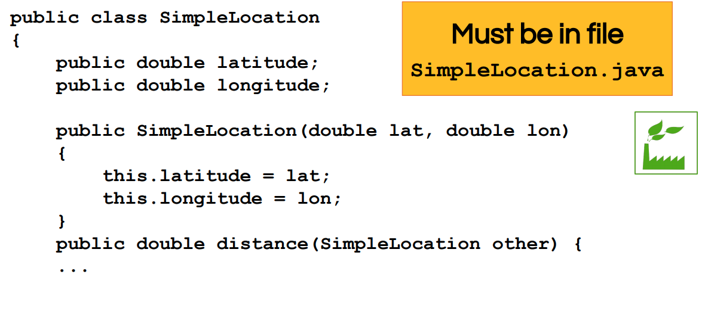
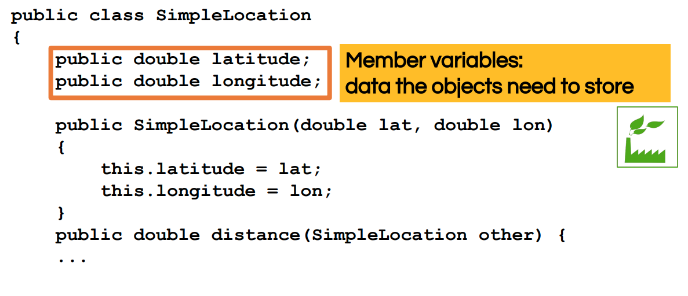
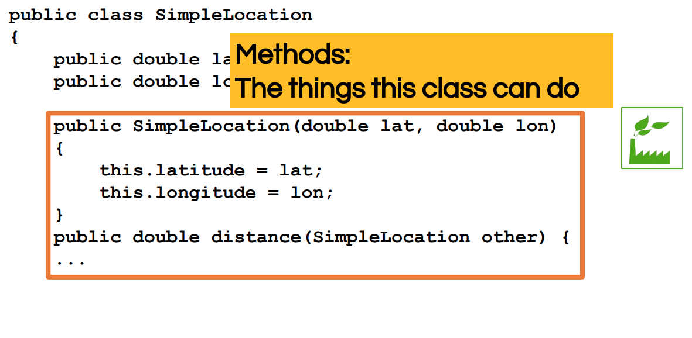
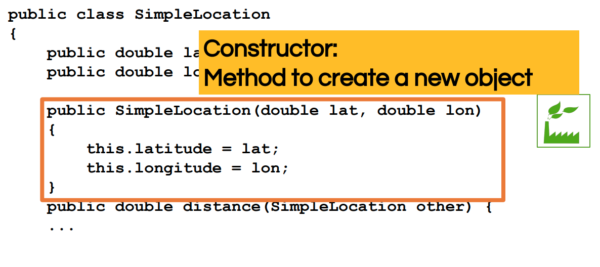
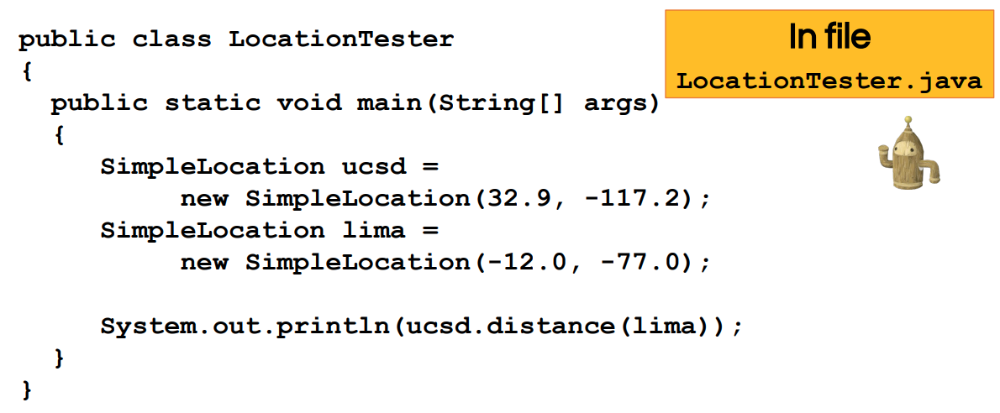
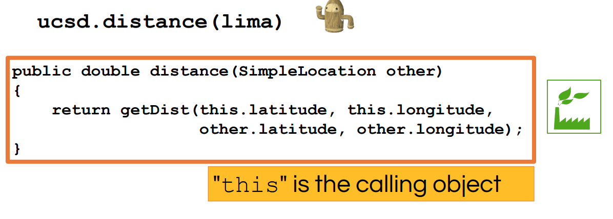

# Week One

## Define a class:

A class is a type of data.

An object is one such piece of data, *with associated functionality.*

Member variable

Methods

Constructor

Constructor has no return type.

## Creating and using objects

key word: new.

This refers to the calling object, which is the object that called the method, or which the method was called.