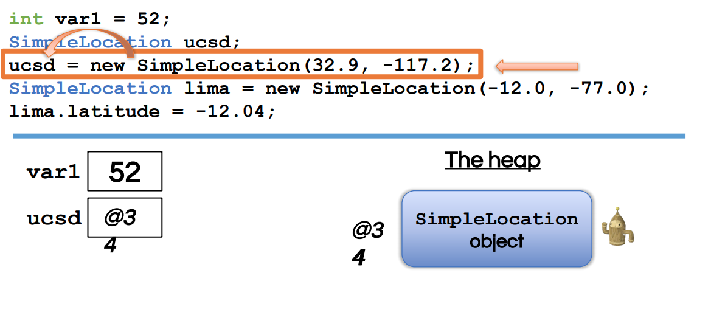
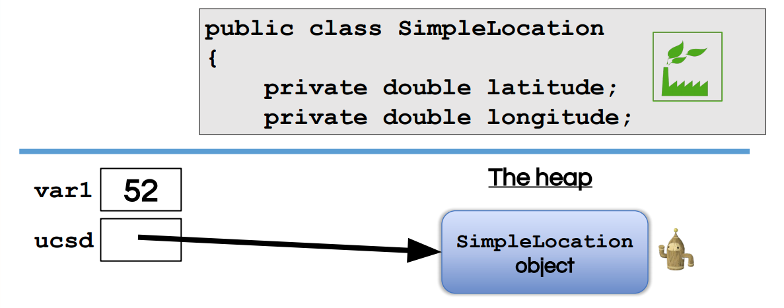
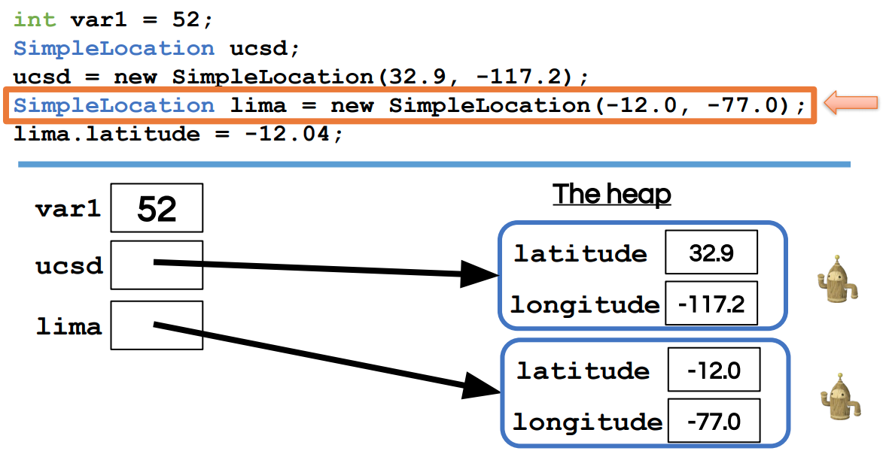
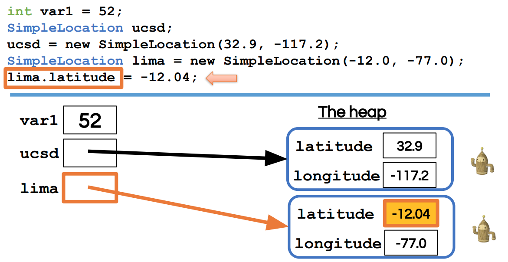
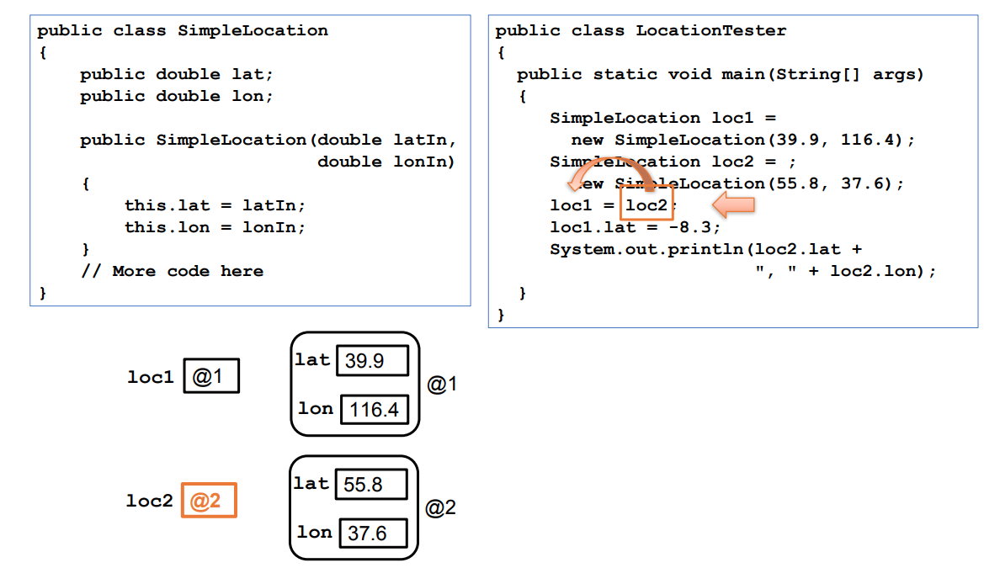
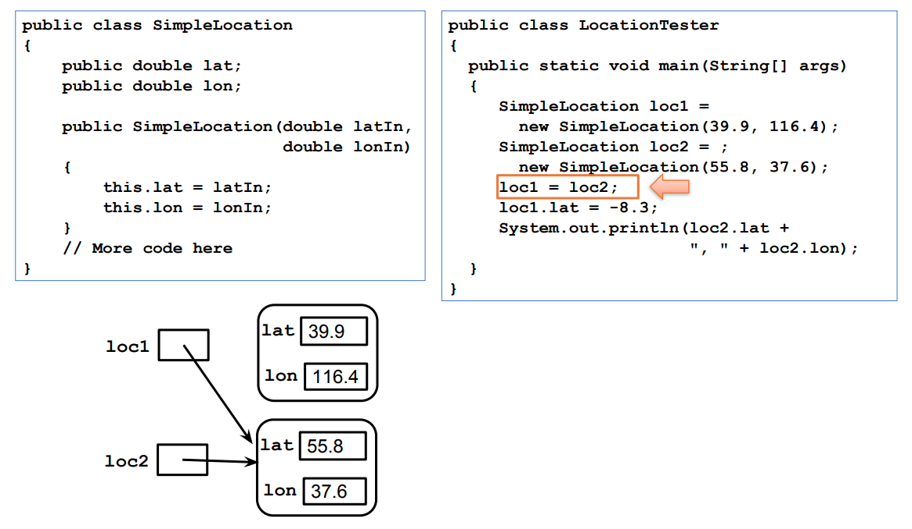
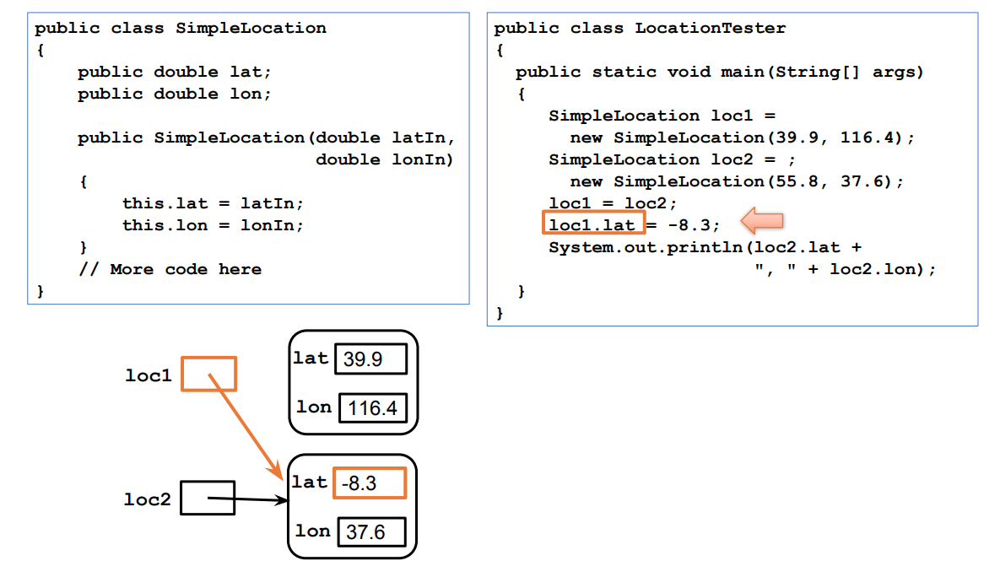
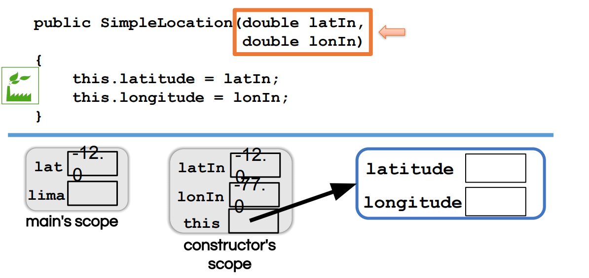
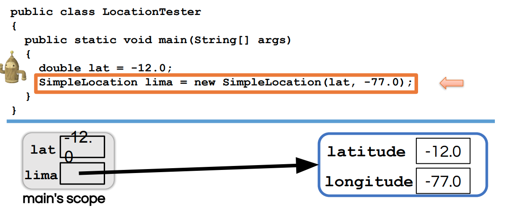

# Memory model

### Primitive type data: only 8 types!
* int
* double
* float
* short
* long
* char
* boolean
* byte

### Drawing memory model with Objects(Arrays and classes)

Object type variable stores a reference, which is essentially just a number representing the location of this newly created object in memory. 

@34 represent the address where storing the object. 

## Practice

when "=", it is just copying address.

# Scope 

Member variables are declared outside any method.

Local variables are declared inside a method.

* main's scope
* constructor's scope
* heap
  

Now, the constructor is over. So what happens to its scope? Well, when a method ends, its scope disappears. So all those local variables, the parameters, any variable that has been declared locally, they disappear. 

NOTE: this is optional.
Firstly, the function will look latitude in the constructor's local scope. If does not find it, so it will look in calling object scope. 