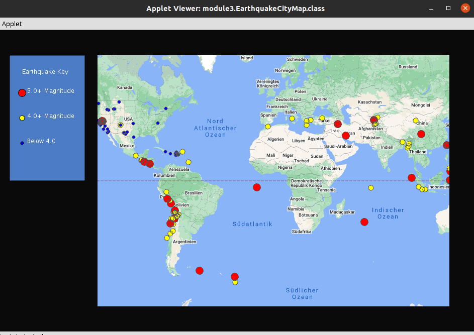

# Week 3 Creating GUIs and Displaying Data

**Step one: Set up a canvas and the map.**

**Step two: Create the markers and load the live earthquake data.**

```java
// The List you will populate with new SimplePointMarkers
List<Marker> markers = new ArrayList<Marker>();

//Use provided parser to collect properties for each earthquake
//PointFeatures have a getLocation method
List<PointFeature> earthquake = ParseFeed.parseEarthquake(this,earthquakesURL);

```
**Step three: Create markers on the map.**

**Step four: Add the legend.**




More learned:

* Work with Java's ArrayList class and List type
* Create containers with generic types
